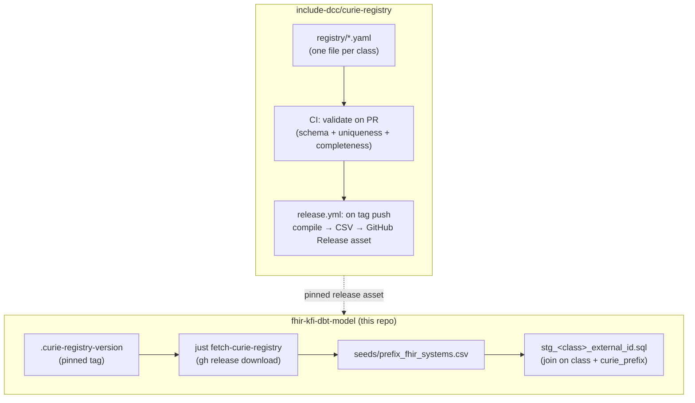

# Curie → FHIR System Registry

Status: proposed · Owner: Eric Torstenson · Repo (new): `include-dcc/curie-registry`

## Problem


External IDs on INCLUDE Access Model classes (`Study.external_id`, `Sample.external_id`, `Subject.external_id`, …) are LinkML `uriorcurie` values — in practice almost all curies, e.g. `DBGAP:phs000123`. To mint a valid FHIR `Identifier`, each one needs a `system` URI, which depends on:

1. **`curie_prefix`** — the part before the colon (`DBGAP`)
2. **class** — which resource the identifier belongs to (a `Study`'s `DBGAP` accession and a `Sample`'s are different systems)
3. **`fhir_system`** — the resulting `Identifier.system` URI

Two further wrinkles inform the schema, one grounded and one still speculative:

- **program.** We support two programs today, INCLUDE and Kids First (`kf`), with `other` as a documented third option (see `study_program` in the access model). The same conceptual identifier can be minted differently per program — e.g. study global IDs — so `program` needs to be available as an optional disambiguator alongside `class`. One complication worth flagging up front: a `Study` can belong to more than one program at once (`study_program` is a multivalued linking table), so this isn't guaranteed to be a clean 1:1 join — see the follow-up note under [Consumption from this repo](#consumption-from-this-repo).
- **Whether `(class, curie_prefix)` is always enough *within* a single class.** This is an open question, not a confirmed problem — nothing in the current model demonstrates it. The example that comes to mind (a dbGaP *study* accession `phsNNNNNN` vs. a dbGaP *dataset* accession `phtNNNNNN`) doesn't actually hold up: study and dataset are already separate classes here, so class alone disambiguates them fine. It's still a useful stand-in for the *shape* of the risk — some future prefix could plausibly encode more than one accession sub-type within one class — so the schema below includes an escape hatch for it. Treat that part of the schema as unproven until a real example shows up.

### TLDR

Class based YAML files associate prefixes to FHIR system an optional program and value_pattern regex matcher. Github actions on PR will run a validate that no dupes or other problemmatic changes were made. Tagging will trigger the production of the actual artifact to be consumed by this repo and Brenda's ftd-schema which I believe feeds into the pipeline(s). 

### Current state (as of this writing)

- `seeds/prefix_fhir_systems.csv` exists today with two columns (`curie_prefix, fhir_system`) and **one row** (`DBGAP`). No `class` column, no schema tests, no uniqueness/completeness checks.
- Its only consumer is `models/staging/stg_research_study_external_id.sql`, which extracts the prefix via the `extract_curie_prefix` macro (`trim(lower(split_part(value, ':', 1)))`) and left-joins on `curie_prefix` alone.
- The source model (`models/access/src_dev_include_access.yml`) has **20** `*_external_id` linking tables, one per LinkML class that carries external identifiers: `include_participant`, `record`, `study`, `study_metadata`, `virtual_biorepository`, `doi`, `investigator`, `publication`, `subject`, `demographics`, `family`, `family_relationship`, `family_member`, `subject_assertion`, `sample`, `biospecimen_collection`, `aliquot`, `encounter`, `encounter_definition`, `activity_definition`, `file`.
- Only `research_study` has a staging model built so far; the other 19 classes will need the same `stg_<class>_external_id.sql` treatment eventually, each needing this registry.

This confirms the registry needs to scale to ~20 class-scoped files, not the 2–3 that exist conceptually today — reinforcing the "split by class" plan.

## Goals

- Class-scoped ownership: a data engineer who owns `sample` curies shouldn't need review from whoever owns `study` curies.
- Machine-validated (uniqueness, completeness, well-formed URIs) before anything downstream trusts it.
- Cheap to extend: adding one prefix is a small YAML PR, not a schema migration.

## Non-goals

- Not a general-purpose FHIR terminology server — just the `curie_prefix → system` lookup dbt needs at build time.
- Not the identifier-minting logic itself (that's Dewrangle / the staging models) — this is metadata they join against.

## Architecture

Two repositories, loosely coupled through GitHub Releases rather than a submodule — the registry is compiled *data*, not source this project builds from, and the consuming side (this repo, and future consumers) should be able to pin a version without depending on the registry repo's toolchain.



## Registry repo layout

```
curie-registry/
  registry/
    study.yaml
    sample.yaml
    subject.yaml
    participant.yaml
    ...                    # one file per class, ~20 to start
  schema/
    entry.schema.json       # JSON Schema for a single registry/*.yaml file
  scripts/
    compile.py               # validate all files, emit the merged CSV
  tests/
    test_compile.py           # uniqueness / completeness / pattern-overlap checks
  .github/
    CODEOWNERS                # map registry/<class>.yaml -> class owner(s)
    workflows/
      ci.yml                  # PR: compile.py --check + pytest
      release.yml              # tag push: compile.py --emit dist/prefix_fhir_systems.csv, attach to Release
  README.md
```

`CODEOWNERS` is what actually gives you the per-class review boundary — file-per-class is necessary but not sufficient without it.

## Entry schema

```yaml
# registry/study.yaml
class: study          # must match the filename stem — validated, not just convention
entries:
  - curie_prefix: SD
    program: kf                              # optional — disambiguates when one prefix
    fhir_system: "https://kf-api-dataservice.kidsfirstdrc.org/studies/"   # means different things per program
    description: "Kids First study global ID"
  - curie_prefix: SD
    program: include
    fhir_system: "https://dewrangle.org/include-dcc/"
    description: "INCLUDE study global ID"
```

Base key = `(class, curie_prefix)`, extended by two independent, optional discriminators when that pair isn't unique on its own:

- **`program`** — grounded in a real need: the same prefix can be minted per-program with a different resolvable system (INCLUDE vs. Kids First today; `other` is a documented third program in the access model, and there may be more later).
- **`value_pattern`** (regex, matched against the value itself) — a speculative escape hatch for the case discussed above, where one prefix might encode more than one accession sub-type *within a single class*. Nothing in the model currently needs this; it's here so the schema doesn't have to change shape if it turns out to be necessary.

```yaml
# illustrative only — no confirmed real-world case needs this yet
entries:
  - curie_prefix: DBGAP
    value_pattern: "^phs\\d+"
    fhir_system: "https://www.ncbi.nlm.nih.gov/projects/gap/cgi-bin/study.cgi?study_id="
    description: "hypothetical: one sub-type of a DBGAP accession within this class"
  - curie_prefix: DBGAP
    value_pattern: "^pht\\d+"
    fhir_system: "https://www.ncbi.nlm.nih.gov/projects/gap/cgi-bin/dataset.cgi?study_id="
    description: "hypothetical: a different sub-type, same class, same prefix"
```

Rules, for whichever discriminator(s) a given `(class, curie_prefix)` group actually needs:

- Most entries need nothing beyond `curie_prefix` + `fhir_system` — `program` and `value_pattern` are both opt-in, not the default shape.
- If a `(class, curie_prefix)` group has more than one entry, every entry in that group **must** carry whichever discriminator(s) distinguish it, except optionally one catch-all entry with none, which must be listed last (`compile.py` enforces ordering so the catch-all can't shadow a specific one).
- Matching at query time: filter candidates by `(class, curie_prefix)`, narrow by `program` if the group is program-disambiguated, then by the first matching `value_pattern` if it's also (or instead) pattern-disambiguated — falling back to the catch-all if present.

The `program` piece is worth building; the `value_pattern` piece is worth designing for but not worth building until a real example shows up — see [Open questions](#open-questions).

## Compilation & validation rules (`compile.py`, run in CI on every PR)

- Each `registry/*.yaml` validates against `schema/entry.schema.json` (required fields, types).
- `class` field matches the filename stem.
- No duplicate `(class, curie_prefix, program, value_pattern)` tuples.
- `program`, if present, is one of the access model's accepted values (`include`, `kf`, `other`, ...).
- Within a `(class, curie_prefix)` group with multiple entries, every entry has a `program` and/or `value_pattern` except at most one trailing catch-all.
- `fhir_system` parses as an absolute URI with a scheme (`http`/`https`/`urn`).
- `curie_prefix` non-empty; normalized case-insensitively (matches the existing `extract_curie_prefix` macro, which already lowercases both sides of the join).
- `compile.py --check` runs validation only (used in `ci.yml`, blocks merge on failure); `compile.py --emit <path>` also writes the merged CSV (used in `release.yml`).

## CI

- **`ci.yml`** (on `pull_request`): `compile.py --check` + `pytest` — fast feedback for a data engineer adding one prefix, no merge without green CI.
- **`release.yml`** (on tag push `v*`): `compile.py --emit dist/prefix_fhir_systems.csv`, create a GitHub Release for that tag, attach the CSV. Tag = registry version.

## Consumption from this repo

- A pinned version file, e.g. `.curie-registry-version` (contents: `v0.3.0`), reviewed like any other dependency bump.
- A `just fetch-curie-registry` recipe (mirrors the existing `flatten-test-data` pattern in the justfile):
  ```
  fetch-curie-registry:
    gh release download $(cat .curie-registry-version) \
      --repo include-dcc/curie-registry \
      --pattern prefix_fhir_systems.csv \
      --dir fhir_kfi_dbt_model/seeds/ --clobber
  ```
- Wire it in as a prerequisite of the existing `seed` recipe, same way `flatten-test-data` is today.
- No change needed to how dbt loads it — `seeds/prefix_fhir_systems.csv` is already `{{ ref('prefix_fhir_systems') }}`'d by `stg_research_study_external_id.sql`.

This is a reasonable default given how the rest of this project already pulls in test fixtures, but it's not a settled decision, and there's a real candidate for what the *actual* production path might be instead — see below.

### Possible production path: a schema-feeder repo (name/org unconfirmed)

There may already be a real integration point for this that makes the above moot for production use: a repo referred to as `ftd-schema` (exact org and spelling unconfirmed — possibly `carrolllaboratory/ftd-schema`) with scripts that pull together multiple schemas as "feeders" for a collaborator's pipeline. If `curie-registry` gets added to that feeder list, its output may auto-populate into the real dbt runs without this repo needing its own fetch step at all — in which case `just fetch-curie-registry` above is a local/POC-dev convenience, not the production path.

Worth confirming directly rather than assuming: the exact repo name/org, what "feeder" means mechanically (does it compile/validate itself, or does it expect an already-compiled artifact like `compile.py --emit` produces?), and what format it actually wants — which would also answer the CSV/JSON question in [Open questions](#open-questions).

### Follow-up needed in this repo once `class` (and possibly `program` / `value_pattern`) land

`stg_research_study_external_id.sql` currently joins the seed on `curie_prefix` alone. Once the seed gains a `class` column, that join needs a `class = 'study'` filter (and the same update needs to happen in each future `stg_<class>_external_id.sql`). If `program` ships too, the join also needs a `program` match — and since a `Study` can carry more than one program (`study_program` is multivalued), a naive join could fan out one external-id row into multiple candidate matches; that needs actual resolution logic, not just an extra `on` clause. If `value_pattern` ever ships, the join becomes a pattern match against the extracted value rather than a plain equality. Regardless of which of these land, it's worth a shared macro (`resolve_fhir_system(value, class, program)`) instead of repeating the join logic per staging model.

## Open questions

1. Confirm `value_pattern` is actually needed with a real example before building it — nothing in the current model demonstrates a same-class, same-prefix collision; if it never comes up, drop it and keep the schema simpler.
2. Work out the program/study relationship properly: since a `Study` can belong to more than one program at once, "look up the system for this program" isn't always a single unambiguous answer. Needs a real proposal, not just a schema field.
3. **Confirm the `ftd-schema` lead** (see "Possible production path" under [Consumption from this repo](#consumption-from-this-repo)) — exact repo/org, how "feeder" works mechanically, and what format it wants. This would settle both how the registry plugs into the real pipeline *and* the CSV/JSON question below, and might mean the `fetch-curie-registry` approach sketched here never ships as the production path at all.
4. First migration PR: move today's single `DBGAP` row into `registry/study.yaml` (or wherever it actually belongs — worth double-checking it's study-scoped and not currently misapplied to some other class), scaffold the other 19 class files empty/stubbed.
5. Should there be a CSV/JSON dual output for non-dbt consumers, or is CSV sufficient for now? Likely answered by (3) above once confirmed.
