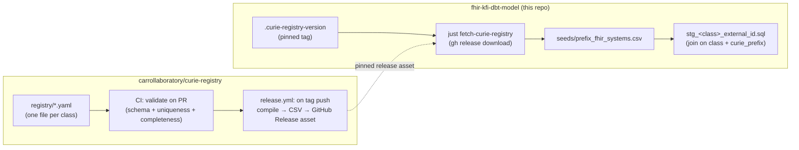

# Curie → FHIR System Registry

Status: proposed · Owner: Eric Torstenson · Repo (new): `carrollaboratory/curie-registry`

## Problem

External IDs on INCLUDE Access Model classes (`Study.external_id`, `Sample.external_id`, `Subject.external_id`, …) are LinkML `uriorcurie` values — in practice almost all curies, e.g. `DBGAP:phs000123`. To mint a valid FHIR `Identifier`, each one needs a `system` URI, which depends on:

1. **`curie_prefix`** — the part before the colon (`DBGAP`)
2. **class** — which resource the identifier belongs to (a `Study`'s `DBGAP` accession and a `Sample`'s are different systems)
3. **`fhir_system`** — the resulting `Identifier.system` URI

A single curie prefix can also resolve to *different* systems **within the same class**, depending on what kind of accession the value actually encodes (e.g. a dbGaP *study* accession `phsNNNNNN` vs. a dbGaP *dataset* accession `phtNNNNNN`). Class alone doesn't always disambiguate — see [Entry schema](#entry-schema).

### Current state (as of this writing)

- `seeds/prefix_fhir_systems.csv` exists today with two columns (`curie_prefix, fhir_system`) and **one row** (`DBGAP`). No `class` column, no schema tests, no uniqueness/completeness checks.
- Its only consumer is `models/staging/stg_research_study_external_id.sql`, which extracts the prefix via the `extract_curie_prefix` macro (`trim(lower(split_part(value, ':', 1)))`) and left-joins on `curie_prefix` alone.
- The source model (`models/access/src_dev_include_access.yml`) has **20** `*_external_id` linking tables, one per LinkML class that carries external identifiers: `include_participant`, `record`, `study`, `study_metadata`, `virtual_biorepository`, `doi`, `investigator`, `publication`, `subject`, `demographics`, `family`, `family_relationship`, `family_member`, `subject_assertion`, `sample`, `biospecimen_collection`, `aliquot`, `encounter`, `encounter_definition`, `activity_definition`, `file`.
- Only `research_study` has a staging model built so far; the other 19 classes will need the same `stg_<class>_external_id.sql` treatment eventually, each needing this registry.

This confirms the registry needs to scale to ~20 class-scoped files, not the 2–3 that exist conceptually today — reinforcing the "split by class" plan.

## Goals

- Class-scoped ownership: a data engineer who owns `sample` curies shouldn't need review from whoever owns `study` curies.
- The registry outlives this dbt project. It's POC-stage and may not survive past initial dev; the registry is reference data that other consumers (other dbt projects, other services) should be able to depend on independent of this repo's lifecycle.
- Machine-validated (uniqueness, completeness, well-formed URIs) before anything downstream trusts it.
- Cheap to extend: adding one prefix is a small YAML PR, not a schema migration.

## Non-goals

- Not a general-purpose FHIR terminology server — just the `curie_prefix → system` lookup dbt needs at build time.
- Not the identifier-minting logic itself (that's Dewrangle / the staging models) — this is metadata they join against.

## Architecture

Two repositories, loosely coupled through GitHub Releases rather than a submodule — the registry is compiled *data*, not source this project builds from, and the consuming side (this repo, and future consumers) should be able to pin a version without depending on the registry repo's toolchain.



## Registry repo layout

```
curie-registry/
  registry/
    study.yaml
    sample.yaml
    subject.yaml
    participant.yaml
    ...                    # one file per class, ~20 to start
  schema/
    entry.schema.json       # JSON Schema for a single registry/*.yaml file
  scripts/
    compile.py               # validate all files, emit the merged CSV
  tests/
    test_compile.py           # uniqueness / completeness / pattern-overlap checks
  .github/
    CODEOWNERS                # map registry/<class>.yaml -> class owner(s)
    workflows/
      ci.yml                  # PR: compile.py --check + pytest
      release.yml              # tag push: compile.py --emit dist/prefix_fhir_systems.csv, attach to Release
  README.md
```

`CODEOWNERS` is what actually gives you the per-class review boundary — file-per-class is necessary but not sufficient without it.

## Entry schema

```yaml
# registry/study.yaml
class: study          # must match the filename stem — validated, not just convention
entries:
  - curie_prefix: DBGAP
    fhir_system: "https://www.ncbi.nlm.nih.gov/projects/gap/cgi-bin/study.cgi?study_id="
    value_pattern: "^phs\\d+"       # optional — disambiguates when one prefix maps
    description: "dbGaP study accession (phs number)"          # to multiple systems within this class
  - curie_prefix: DBGAP
    fhir_system: "https://www.ncbi.nlm.nih.gov/projects/gap/cgi-bin/dataset.cgi?study_id="
    value_pattern: "^pht\\d+"
    description: "dbGaP dataset accession (pht number)"
```

Key = `(class, curie_prefix)`, extended by `value_pattern` when that pair isn't unique. Rules:

- Most classes need nothing beyond `curie_prefix` + `fhir_system` — `value_pattern` is an escape hatch, not the default shape.
- If a `(class, curie_prefix)` group has more than one entry, every entry in that group **must** carry a `value_pattern`, except optionally one catch-all entry with none, which must be listed last (compile.py enforces ordering so the catch-all can't shadow a specific pattern).
- Matching at query time becomes: filter candidates by `(class, curie_prefix)`, then pick the first entry whose `value_pattern` matches the actual external-id value (or the catch-all).

This is the one open design question worth confirming with real dbGaP (and any other multi-accession-type) examples before locking the schema — see [Open questions](#open-questions).

## Compilation & validation rules (`compile.py`, run in CI on every PR)

- Each `registry/*.yaml` validates against `schema/entry.schema.json` (required fields, types).
- `class` field matches the filename stem.
- No duplicate `(class, curie_prefix, value_pattern)` triples.
- Within a `(class, curie_prefix)` group with multiple entries, every entry has a `value_pattern` except at most one trailing catch-all.
- `fhir_system` parses as an absolute URI with a scheme (`http`/`https`/`urn`).
- `curie_prefix` non-empty; normalized case-insensitively (matches the existing `extract_curie_prefix` macro, which already lowercases both sides of the join).
- `compile.py --check` runs validation only (used in `ci.yml`, blocks merge on failure); `compile.py --emit <path>` also writes the merged CSV (used in `release.yml`).

## CI

- **`ci.yml`** (on `pull_request`): `compile.py --check` + `pytest` — fast feedback for a data engineer adding one prefix, no merge without green CI.
- **`release.yml`** (on tag push `v*`): `compile.py --emit dist/prefix_fhir_systems.csv`, create a GitHub Release for that tag, attach the CSV. Tag = registry version.

## Consumption from this repo

- A pinned version file, e.g. `.curie-registry-version` (contents: `v0.3.0`), reviewed like any other dependency bump.
- A `just fetch-curie-registry` recipe (mirrors the existing `flatten-test-data` pattern in the justfile):
  ```
  fetch-curie-registry:
    gh release download $(cat .curie-registry-version) \
      --repo carrollaboratory/curie-registry \
      --pattern prefix_fhir_systems.csv \
      --dir fhir_kfi_dbt_model/seeds/ --clobber
  ```
- Wire it in as a prerequisite of the existing `seed` recipe, same way `flatten-test-data` is today.
- No change needed to how dbt loads it — `seeds/prefix_fhir_systems.csv` is already `{{ ref('prefix_fhir_systems') }}`'d by `stg_research_study_external_id.sql`.

### Follow-up needed in this repo once `class` (and possibly `value_pattern`) land

`stg_research_study_external_id.sql` currently joins the seed on `curie_prefix` alone. Once the seed gains a `class` column, that join needs a `class = 'study'` filter (and the same update needs to happen in each future `stg_<class>_external_id.sql`). If `value_pattern` ships, the join becomes a pattern match against the extracted value rather than a plain equality — worth a shared macro (`resolve_fhir_system(value, class)`) instead of repeating the join logic per staging model.

## Open questions

1. Confirm `value_pattern` is actually needed with real examples (dbGaP study vs. dataset vs. subject accessions) before building it — if class alone always disambiguates in practice, drop it and keep the schema simpler.
2. Registry repo name/location: `carrollaboratory/curie-registry` assumed here, matching the `carrollaboratory` org already used for `include-access-model` and `spit-fhir`.
3. First migration PR: move today's single `DBGAP` row into `registry/study.yaml` (or wherever it actually belongs — worth double-checking it's study-scoped and not currently misapplied to some other class), scaffold the other 19 class files empty/stubbed.
4. Should there be a CSV/JSON dual output for non-dbt consumers, or is CSV sufficient for now? Deferred until a second consumer actually exists.
